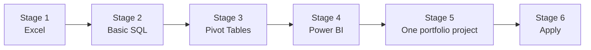

# Data Analyst Roadmap 2026

**How I'd become a self-taught data analyst again in 2026. Six stages, in order, all free. Ends with one real portfolio project you can fork today.**

I'm a senior data analyst.
No tech degree. No tech background when I started.
I learned every skill for $0.00, from YouTube.

This is the roadmap I wish I had on day one.

> Don't start with Python.
> Start with Excel. Learn SQL after Excel. Learn Power BI after SQL.
> Use Claude or ChatGPT as your tutor.

[](https://stanleywangg.com/?utm_source=github&utm_medium=readme&utm_campaign=data-analyst-roadmap)
[](https://www.threads.com/@stanleywangg)
[](https://stanleywangg.substack.com/?utm_source=github&utm_medium=readme&utm_campaign=data-analyst-roadmap)

---

## 🗺️ The roadmap



| Stage | What you learn | Start here |
|---|---|---|
| 1 | Excel | [stage-1-excel](stage-1-excel/) · [your first week of Excel](week-1-excel/) |
| 2 | Basic SQL | [stage-2-basic-sql](stage-2-basic-sql/) |
| 3 | Pivot Tables | [stage-3-pivot-tables](stage-3-pivot-tables/) |
| 4 | Power BI | [stage-4-power-bi](stage-4-power-bi/) |
| 5 | One portfolio project | [stage-5-portfolio-project](stage-5-portfolio-project/) → [Project 01: The Messy Sales Report](project-01-messy-sales-report/) |
| 6 | Apply | [stage-6-apply](stage-6-apply/) |

You're employable by Stage 5.

---

## 📖 Overview

Most beginners don't quit because data analysis is hard.

They quit because every video says something different. Python or SQL first? Excel or Power BI? Which course?

So they collect tutorials and never start.

This repo gives you the order. One stage at a time. Nothing to decide except the next step.

- **Free.** Every teacher and tool in here costs $0.00.
- **In order.** Each stage builds on the one before it.
- **Ends in proof.** Stage 5 is a real project with real messy data, not another tutorial.

---

## 🛠️ Free tools and teachers

Everything is free.

| Skill | Free tool | Free teachers on YouTube |
|---|---|---|
| Excel | Excel or [Google Sheets](https://sheets.google.com) | [Leila Gharani](https://www.youtube.com/@LeilaGharani) · [Kenji Explains](https://www.youtube.com/@KenjiExplains) · [MyOnlineTrainingHub](https://www.youtube.com/@MyOnlineTrainingHub) |
| SQL | [SQLite Online](https://sqliteonline.com) (runs in your browser) | [Alex The Analyst](https://www.youtube.com/@AlexTheAnalyst) · [Data with Baraa](https://www.youtube.com/@DataWithBaraa) · [techTFQ](https://www.youtube.com/@techTFQ) · [Ankit Bansal](https://www.youtube.com/@ankitbansal6) |
| Power BI | [Power BI Desktop](https://apps.microsoft.com/detail/9ntxr16hnw1t) (free, Windows) | [How to Power BI](https://www.youtube.com/@HowtoPowerBI) · [Curbal](https://www.youtube.com/@CurbalEN) |
| Practice data | [Kaggle datasets](https://www.kaggle.com/datasets) | |
| Your tutor | Claude or ChatGPT (free tier is fine) | |

---

## 🎯 Stage 5: the portfolio project

**[Project 01: The Messy Sales Report](project-01-messy-sales-report/)**

Your manager drops a sales export on you Monday morning.
Three date formats in one column. Duplicate orders. Prices stored as text.
"Which regions and products are slipping? Board meeting Thursday."

You clean it with a paper trail, find the story, and build a one-page dashboard.

- 812 rows of realistic messy data in [`datasets/`](project-01-messy-sales-report/datasets/)
- A step-by-step guide, with AI prompts that make you understand the work, not skip it
- Self-checks so you know your numbers are right

**Fork this repo. Do the project. Put your finished file and write-up in your fork.** That fork is your portfolio.

Finished? Post it on Threads and tag [@stanleywangg](https://www.threads.com/@stanleywangg).

---

## 📂 Repository structure

```
data-analyst-roadmap/
├── README.md
├── stage-1-excel/
├── stage-2-basic-sql/
├── stage-3-pivot-tables/
├── stage-4-power-bi/
├── stage-5-portfolio-project/
├── stage-6-apply/
├── week-1-excel/
└── project-01-messy-sales-report/
    ├── README.md                     # the step-by-step guide
    ├── write-up-template.md          # your case study, for your fork
    └── datasets/
        └── fernway-sales-messy.csv   # 812 rows, messy on purpose
```

---

## ➕ Want more structure?

The roadmap above is free and always will be. If you want me to hold your hand through it:

- **[The Self-Taught Data Analyst Roadmap](https://stan.store/stanleywangg/p/the-selftaught-data-analyst-roadmap?utm_source=github&utm_medium=readme&utm_campaign=data-analyst-roadmap)**: every skill in the three pillars, a test for each one so you know you've actually got it, and a tracker.
- **[The 30-Minute Analyst](https://stan.store/stanleywangg/p/the-30minute-analyst?utm_source=github&utm_medium=readme&utm_campaign=data-analyst-roadmap)**: 30 nights, one skill each night, in order. For when you only have 30 minutes.

---

## 🌟 Stay connected

- **Website:** [stanleywangg.com](https://stanleywangg.com/?utm_source=github&utm_medium=readme&utm_campaign=data-analyst-roadmap), answers to the questions beginners actually ask
- **Threads:** [@stanleywangg](https://www.threads.com/@stanleywangg), daily posts, 125K+ followers
- **Newsletter:** [stanleywangg.substack.com](https://stanleywangg.substack.com/?utm_source=github&utm_medium=readme&utm_campaign=data-analyst-roadmap), free, weekly

If this helped, star the repo. It helps the next beginner find it.

---

## 📜 License

Code and datasets: [MIT](LICENSE). Guides and written content: [CC BY 4.0](https://creativecommons.org/licenses/by/4.0/). Share it, remix it, just credit Stanley Wang.

## 👋 About me

I'm Stanley Wang, a senior data analyst.
I started with no tech degree, no tech skills and no tech background.
I taught myself from free YouTube videos, one stage at a time.

You're not behind. You just haven't started yet.
